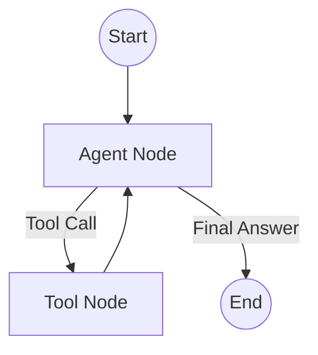

# ✈️ TravelBuddy: AI-Powered Travel Assistant Agent

TravelBuddy is a sophisticated AI agent built on **LangGraph** designed to automate travel planning. It leverages a **ReAct (Reasoning and Acting)** loop to handle complex travel queries, search for flights and hotels, and perform real-time budget calculations.

---

## 🌟 Key Features

- **Multi-Step Reasoning**: Capable of chaining multiple tool calls to fulfill complex requests (e.g., finding a flight, then a matching hotel within a specific budget).
- **Tool Integration**: 
  - `search_flights`: Look up available flights based on origin and destination.
  - `search_hotels`: Find accommodations within a specific city and price range.
  - `calculate_budget`: Real-time addition of expenses and budget tracking.
- **Smart Guardrails**: Focused specifically on travel-related tasks. It gracefully declines out-of-scope requests (e.g., coding help, academic assignments).
- **Natural Language Interface**: Supports Vietnamese and English queries with a friendly, helpful persona.
- **Detailed Logging**: Comprehensive tracking of agent "Thoughts," "Actions," and "Observations."

---

## 🏗 Architecture

TravelBuddy utilizes a state-machine architecture powered by **LangGraph**:

1.  **Agent Node**: Processes user input and determines the next step (direct response or tool call).
2.  **Tool Node**: Executes the requested tools (Flight/Hotel search, Budget calculation).
3.  **Cyclic Loop**: The agent continues this loop until it has gathered all necessary information to provide a final response.



---

## 🛠 Technology Stack

- **Framework**: LangChain & LangGraph
- **LLM**: GPT-4o-mini (OpenAI)
- **Environment**: Python 3.9+
- **Data**: CSV-based data sources (`flights.csv`, `hotels.csv`)

---

## 🚀 Getting Started

### 1. Installation
Clone the repository and install the required dependencies:
```bash
pip install -r requirements.txt
```

### 2. Configuration
Create a `.env` file in the root directory and add your OpenAI API Key:
```env
OPENAI_API_KEY=your_api_key_here
```

### 3. Running the Agent
To start an interactive session with TravelBuddy:
```bash
python agent.py
```

---

## 🧪 Testing and Validation

The project includes a comprehensive test suite `run_tests.py` that covers various scenarios:

1.  **Direct Communication**: Basic greeting and general inquiries.
2.  **Single Tool Execution**: Targeted flight or hotel searches.
3.  **Complex Chaining**: Planning a full trip with budget constraints.
4.  **Information Gathering**: Handling ambiguous or incomplete requests.
5.  **Refusal Logic**: Enforcing domain-specific boundaries.

Detailed test logs and outputs can be found in [test_results.md](./test_results.md).

---

## 📂 Project Structure

- `agent.py`: Core logic for the LangGraph state machine.
- `tools.py`: Implementation of search and calculation tools.
- `system_prompt.txt`: Definition of the agent's persona and constraints.
- `flights.csv` / `hotels.csv`: Mock database for demonstrations.
- `run_tests.py`: Evaluation script for automated testing.

---
*Developed as part of Lab 04 - AI Agentic Coding.*
